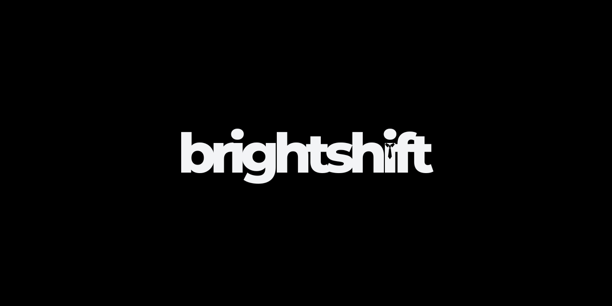

  

<h1 align="center">Brightshift</h1>

  <strong>Empowering Professionals, One Step at a Time</strong>

## About Brightshift

Brightshift is revolutionizing the job search experience with an all-in-one SaaS platform that aggregates opportunities across multiple job boards, communities, and platforms. We're building the ultimate career companion that simplifies the professional journey through intelligent automation and streamlined workflows.

### 🎯 Our Mission

Empowering professionals to discover, apply, and succeed effortlessly.

### 💫 Core Values

- **Simplicity**: Making complex career processes intuitive
- **Empowerment**: Providing tools for professional growth
- **Innovation**: Leveraging cutting-edge technology

### 🚀 Future Roadmap

- Advanced AI-driven career development tools
- Recruiter portal for direct job postings
- Integration with major professional networks
- Enhanced analytics and insights

## Get Involved

We're always looking for talented individuals who share our vision of transforming career development. Whether you're a developer, designer, or career development enthusiast, there are many ways to contribute to Brightshift.

### 📫 Connect With Us

- Website: [brightshift.app](https://brightshift.app)
- [Instagram](https://www.instagram.com/brightshift.app/)
- [Facebook](https://www.facebook.com/people/Brightshift/61570333376956)
- [LinkedIn](https://www.linkedin.com/company/brightshift-app)
- [X.com](https://x.com/Brightshift_app)

---

  <i>Built with ❤️ for professionals worldwide</i>

